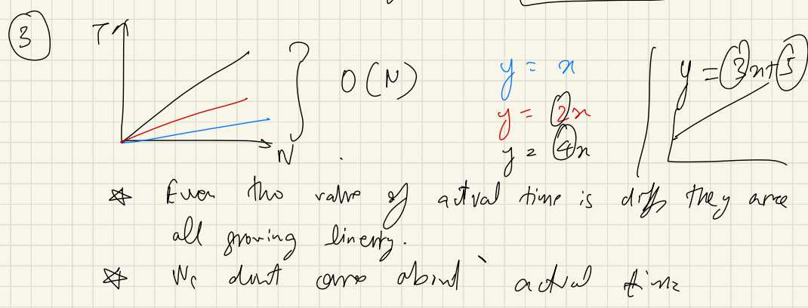
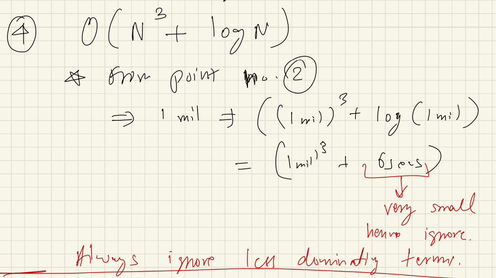
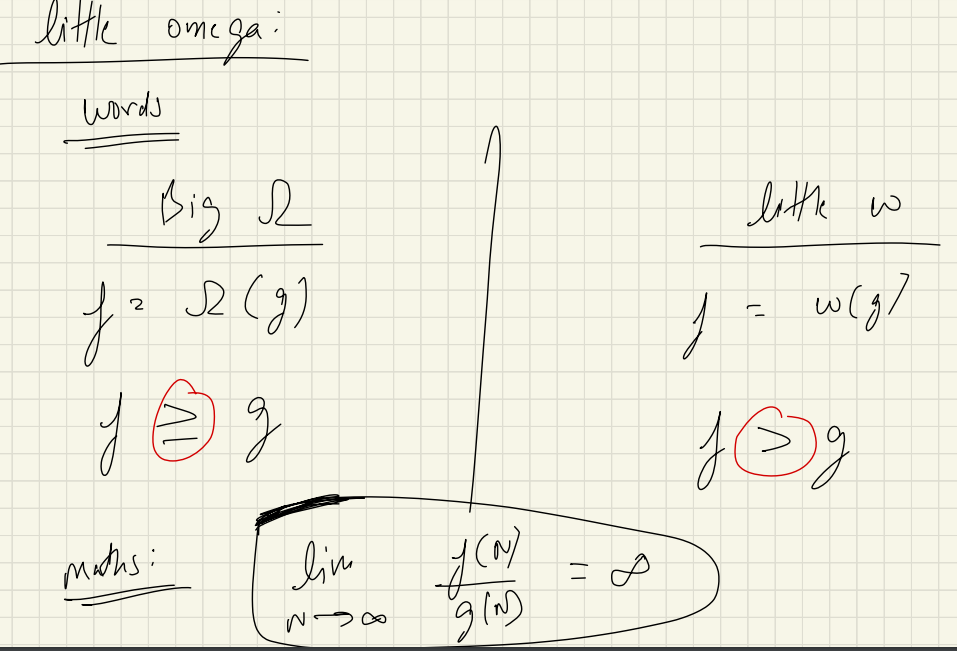
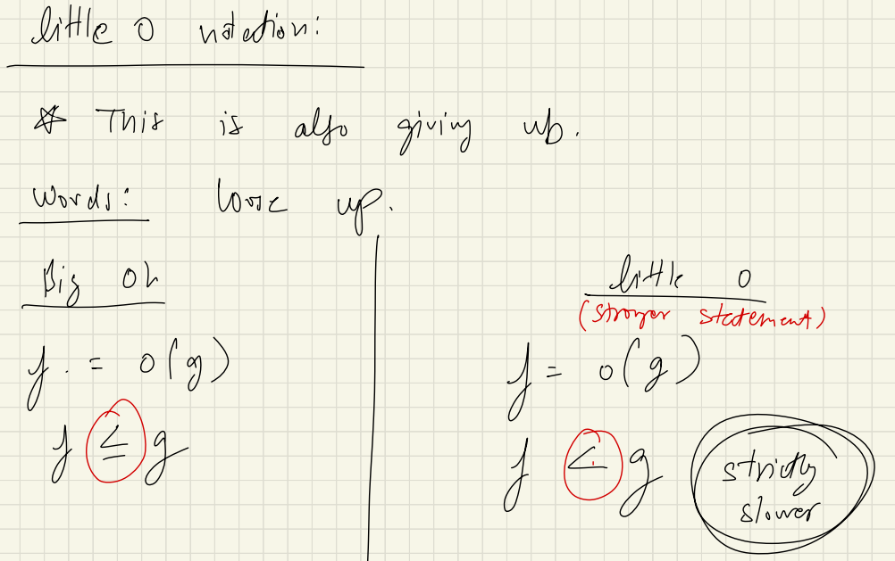
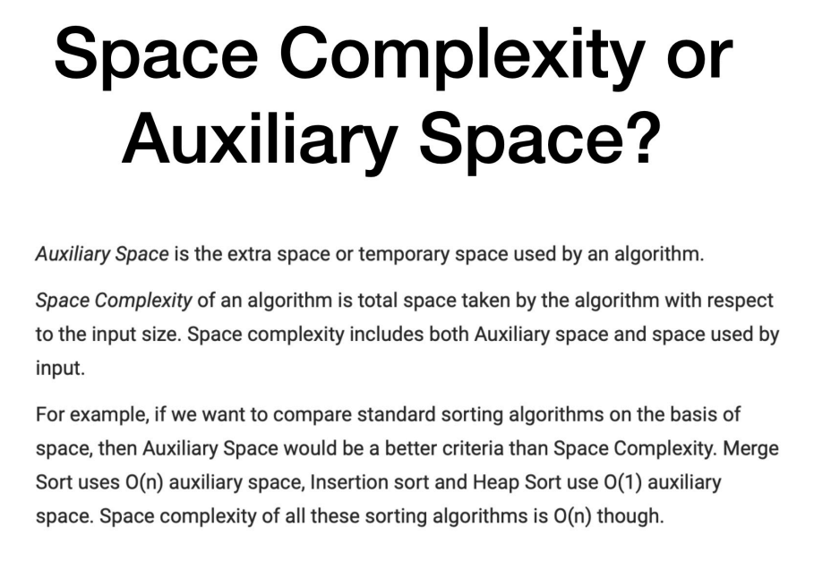
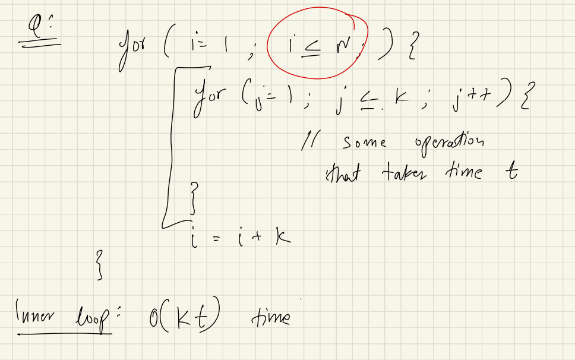
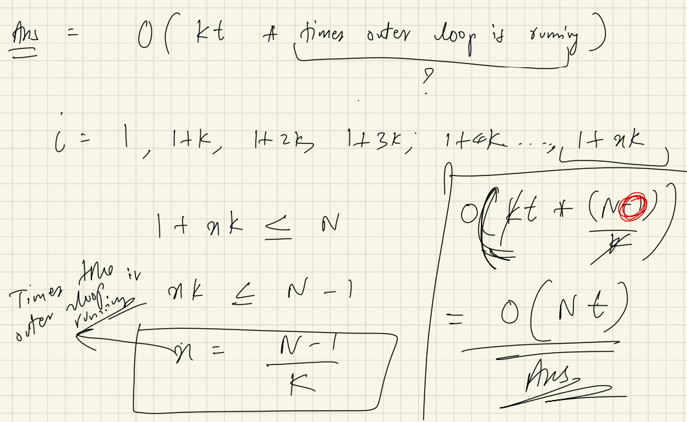
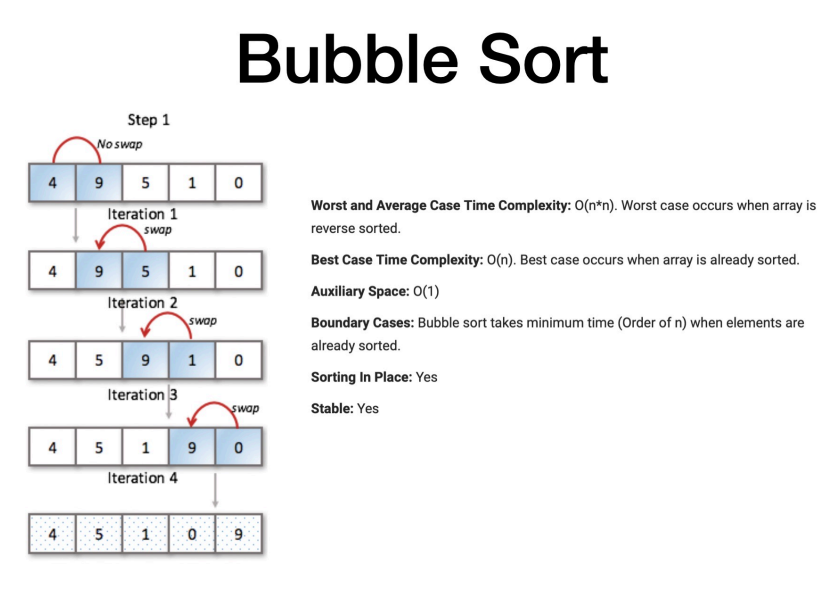
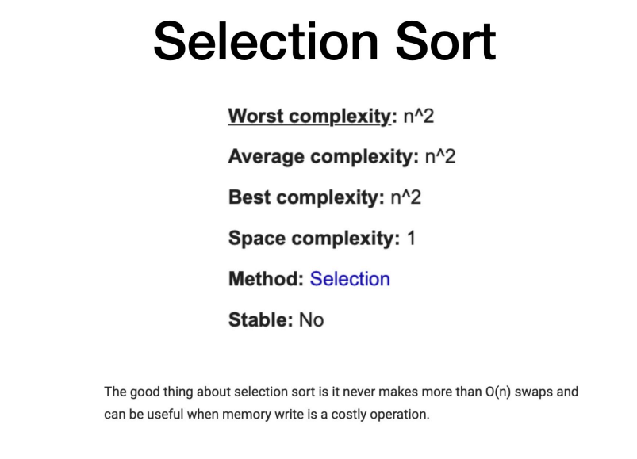
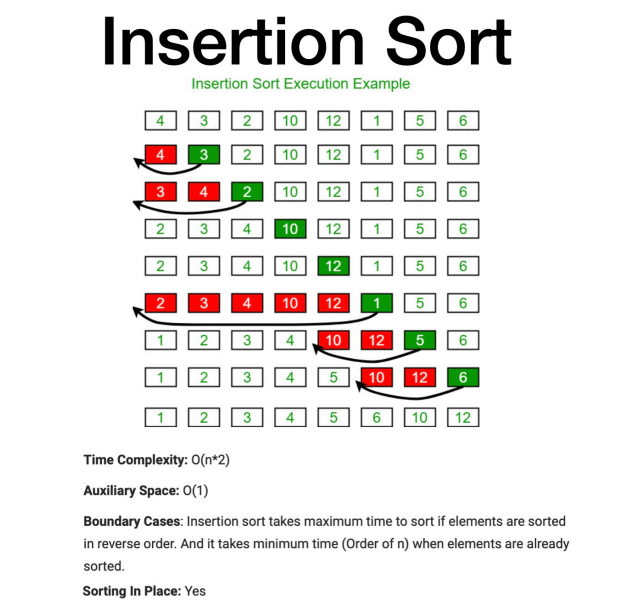

# Time & Space Complexity

## Time Complexity:
Time complexity is a function which gives us relation of how time grows as input size increases. It is denoted by `O(f(n))` where `f(n)` can be any function of `n`.

# What to consider when thinking about Complexity:
1. Always look for Worst Case Scenario/complexity.
2. Always look complexity for large inputs/data as it will gives us info like how much optimised our code is!!
3. Always ignore constants.
   
4. Always ignore the lower order/lower dominent terms.
   for e.g : O(3n^2 + 5n + 7) = O(n^2)
   explaination : we ignored the smaller terms (5n and 7) cause they are very small compared to 3n^2.

   another e.g : Imagine we have a function like this (n^3 + n^2 + n + 1) = 
   and the n is 1million then will the n^2 or n or 1 will affect the n^3? No, right? So we ignore them.

<!-- insert image in readme file -->

# Ways to calculate Time Complexity:
1. Count the number of operations.
2. Find the largest term in the equation.
3. Ignore the constants.

# Types of Notations

1. BigO Notation(O): It specifies the upperbound value of a algorithm, In simpler terms it specifies the value a value that an algorithm can't take/exceeds in terms of time. 
   e.g: Means that if the time complexity of and Algo is: O(N^2)
   then the algorithm can never take time greater than (N^2) like (N^3).

2. BigOmega Notation (Ω): It specifies the lowerbound value of a algorithm, In simpler terms it specifies the value a value that an algorithm minimumly takes/requires to execute the code. 
   e.g: Means that if the time complexity of and Algo is: Ω(N^2)
   then the algorithm can take time greater than (N^2) like (N^3) but it should have time like (N) as it minimum requires N^2.

3. BigTheta Notation (θ) : It specifies the average/middle bound of an algorithm.

## some other types of Notations:

## Space Complexity:

## Example Question

## Sorting Algorithms Analysis

